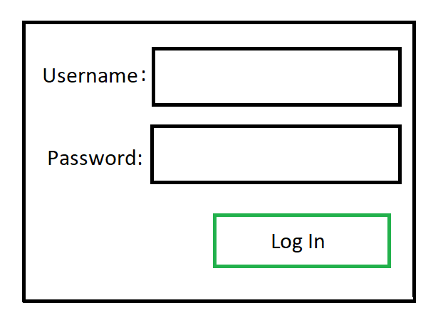

**Document Header**

Platformer Game 06/22/2020 Version: 0.0

Platformer Game 07/08/2020 Version 1.0

Platformer Game 08/06/2020 Version 3.0

**Project Abstract**

This project will be a platformer game in which the player controls a character going through various obstacles in order to reach a goal screen/goal state. There will be pickups of food/water along to the way to maintain the character’s nourishment. Depleting these resources or falling off the map will result in a small setback in time. These runs will be timed. In a single-player instance, the user will be playing against themselves in the essence of trying to get the lowest time possible, while in the multiplayer setting, the users will be racing against the others in order to see who could reach the end state the fastest. We will use OpenWeatherMap API and Phaser 3 as our game engine in order to have a dynamic background for the game.

The game’s goal shifted to one where the players compete with one another. The aspect of having power ups remains, but the overall goal of the game has shifted. The player now focuses on defeated monsters and other players in order to achieve the highest score. There is a timer on how long each round lasts.

**Customer**

The customer for this software is most likely to be a younger audience where the most common age groups are from ages 7-22. This software is intended for gamers both hardcore and casual and mostly younger people who have a lot of free time and do not need to invest a lot of resources to learn how to play. That is the target audience however the game is simple enough to play that it could be played by anyone in their free time.

**Competitive Analysis**

Our competitors are any other companies who make platforming games. Most platforming games are single-player and don’t have many real-time features. The real-time features we plan to implement are chat and multiplayer. Another feature that stands out from the competition is the competitive nature of our game. Not many platformers have a race to the end.

Overtime, we shifted our game idea to one where the players compete with one another and try to eliminate the highest number of players/monsters and achieve the highest score. This is unique as the idea of multiple players competing against various monsters as well as other players while on platforms has not been explored to a great extent.

**Velocity Measurement Legend:**

We will be using a scale from 1 to 5 (1, 2, 3, 4, 5) which corresponds to how difficult a certain portion will be to implement. For a portion/feature that will be extremely easy to implement, it will have a Velocity score of 1. For something that is extremely difficult to implement, it will have a velocity score of 5.

**User Stories**

*   Administrator Role:
    *   Name: Admin
    *   Triggers/Preconditions: Access the Admin state through the Admin Account’s USERNAME and PASSWORD. Upon entering an admin user’s credentials, the admin will then be greeted with an administrator landing page. (Iteration 1 / 2)
        *   The administrator login will be given and there is no method to create an Administrator account. All accounts created through account creation will be defaulted to the basic user. (Implemented in Iteration 1)
        *   View all users and see who else has access to the system. (Implemented in Iteration 1) 
            *   Velocity Rating: 1
        *   Can add, delete, search the new admin and public users using users unique assigned id(implemented in iteration 2)
        *   Can add, delete, search the new admin and public users using users unique email  as it is easy to remember the email for the admin(implemented in iteration 3)
        *   Can access the game page through the admin dashboard and the public users’ dashboard.
    *   The administrator account will NOT have special privileges within the game state and will have the same limitations within the game as all other Standard User Roles (explained below). However, the Administrator’s added benefit is being able to see all registered users. (Planned for Iteration 2)
    *   The administrator will have the ability to remove pre-existing users within the registered users’ database. (Planned for Iteration 2)
    *   The admin will be able to reset their password in case someone forgets it. (Planned for iteration 3)
    *   Test1: Should login a registered admin and take them to the admin landing page. Added test in test/user-tests.js
    *   Velocity Rating 2
*   Admin User Search
    *   Name: Search Users
    *   Actors: This is accessed through the Admin login which is done through the (login) admin main page. The Administrator is the actor.
    *   Actions/Post Conditions: Within the Admin page, they are able to search and see all registered users. These are all the users that are registered and that exist within the database. The administrator can search the users using the unique (user’s id) email registered by the user and can check its rights and other attributes assigned. The administrator can also search the users using the unique (user’s id) email and can check its rights and other attributes assigned. After the Admin wants to see all the users or see a specific user with user-chosen email, the user will be displayed. 
    *   Test: Should find a user with a given id that exists in the database and display it. Added test in test/user-test.js
    *   Iteration: Done in Iteration 2
    *   Velocity Rating: 2
*   Admin User Add
    *   Name: Add Users
    *   Actors This is accessed through the Admin login which is done through the login page. The Administrator is the actor.
    *   Actions/Post Conditions: Within the Admin page, they are able to add new users. Furthermore, the admin will have finer control over the new user’s details such as their roles. Upon adding a user, the user will then be added to the database that contains all other registered users. (This is different from creating a new user on the main landing page)
    *   Test: Should add a single public user on a successful POST request and redirects and renders the admin register page. Added test in test/user-test.js
    *   Iteration: Done in Iteration 2
    *   Velocity Rating: 2
*   Admin User Delete
    *   Name: Delete Users
    *   Actors: This is accessed through the Admin login which is done through the login page. The Administrator is the actor.
    *   Actions/Post Conditions: Within the admin page, the Admin is able to remove any user that exists within the users’ database. The admin will then be able to select a user to delete and will have the option to remove the user from the database. If the user is removed, then the user would no longer exist in the database. The administrator will have the ability to delete pre-existing users within the registered users’ database using their unique (assigned id) email with an exception of the main admin user. The main admin cannot be deleted as he is the main administrator.
    *   Iteration: Done in Iteration 2. 
    *   Testing: Should find a user with a unique email that exists in the database and can delete the user otherwise renders to the delete page with message user does not exist. Added test in test/user-test.js
    *   Velocity Rating: 1
*   Admin Global Password Reset (Planned for Iteration 3)
    *   Name: Reset Passwords
    *   Actors: The Admin and users will be involved. The user may request a password reset, and  the admin will be able to perform such reset.
    *   Actions/Post Conditions: The admin will be able to reset a user’s password. After the task is done, the user will have a new password that they remember or through the webpage they will be able to recreate a password.
    *   Iteration: Planned for iteration 3. 
    *   Velocity rating 3.
        *   This should not be too difficult to implement, as it will take the user’s password field and allow the user to update it. This will be extremely similar to editing a value like Assignment 2 (Dealing with databases)
*   Standard User Role:
    *   Name: User
    *   Triggers/Preconditions: Access the DEFAULT landing page of the website as well as the basic functionality of the game. Within this specific user, they DO NOT have administrator privileges and therefore cannot see all registered users (As mentioned for the administrator role) (Implemented in Iteration 1)
    *   The Standard User Role is accessed by creating an account through the account creation page. Within this page, they will be creating a Standard User account. (Implemented in Iteration 1)
        *   All created users within the Account Creation page will be considered a Standard User account, and all of these accounts will have the same functionality/limitations. (Implemented in Iteration 1)
            *   These accounts can ONLY access the game, everything on the frontend. They cannot access backend data. (Planned for iteration 2)
    *   The Standard User role does NOT have any special permissions and can only access the basic game. (Planned for iteration 2)
    *   The Standard User role does NOT have any special permissions and can only access the basic game. (implemented in iteration 2)
    *   This USER will have stats saved that will be tied with their account. They will be able to view these stats, and perhaps a leaderboard, but they will NOT be able to edit/change/update the stats of ANOTHER user through playing the game. (The user will only be able to play the game on their own account. In order to access another account, they will need the credentials for the other account.) (Planned for Iteration 3)
    *   The User will be able to reset their password in case someone forgets it. (Planned for iteration 3)
    *   Test: Should login a registered user and take them to the game homepage. Added test in test/user-tests.js. 
*   Weather User Story
    *   Name: Weather
    *   Actors: User and OpenWeatherMaps API
    *   Actions/Post Conditions: The weather is seen when the user first logs in and is greeted with the game space. Here, the user will see a background that is reflective of the current local weather (Local to Vancouver). This is done through parsing the data from the OpenWeatherMaps API which provides all local weather in an easy to read/access JSON format. The data was accessed through Ajax, from which the parameter “async” was set to false, to allow for the variables to be accessed later on. The data was then set to variables so that the values could be accessed later. The 3 key weather features used were temperature, clouds, and overall condition. These 3 were set to variables which were later compared to determine which background to use. The temperature, cloudiness, and overall condition each contributed to determining which background image is chosen. 
    *   Test: Gave various boundaries for temperature, cloudiness, and overall conditions. (Used fake/temporary conditions to check that each of the backgrounds could properly be accessed). As of this test, the current temperature is 17.34 degrees celsius, the cloud level is 16 and the overall condition is “Clear”. The temperature exceeds the “if check” of 15 degrees celsius and the cloudiness level falls below the “if check” of 20, and the overall condition (status) is “Clear”. As such, The temperature is considered ClearBlue, and therefore, the background of ClearBlue is used, which is a plain blue sky.
    *   Iteration: Done on iteration 2. 
    *   Velocity Rating 3
*   Movement User Role:
    *   Name: Movement checker 
    *   Actors: Users participating in gameplay
    *   Actions/Post Conditions: The user plays as a Viking character within a map with several platforms located above him. The character’s movement is fully functional and is controlled by the user through arrow keys with the option to move right, left, jump, and increase fall speed. The right and left keys trigger a 9 frame animation sequence that is displayed in succession to create a walking animation. The animation loops while the arrow keys are pressed and finish the 9 frame sequence and stop looping when the key is no longer being used. Two separate animations are implemented for the Viking one for walking left and one for walking right to create the appearance of turning around when shifting from left to right. To travel above the map the user must use the up arrow key to land on platforms. The platforms are set to collide with the Viking so that the character can jump onto the platform without phasing through and allowing the user to traverse through the map. Gravity is active on the character which makes the character fall once at the apex of their jump and can be accelerated by pressing the down arrow key. The Viking speed is set at 100 which allows him to move at a medium and easily controllable speed.
    *   Test: Check if arrow keys correctly trigger correct character animation and character movement.
    *   Iteration: Done on iteration 2. 
    *   Velocity Rating: 4
*   Power Up User:
    *   Name: Powerup checker 
    *   Actors: Users participating in gameplay
    *   Actions/Post Conditions: The user plays as a Viking character within a map with several platforms located above him. The character’s movement is fully functional and is controlled by the user through arrow keys with the option to move right, left, jump, and increase fall speed. Gravity is active on the character which makes the character fall once at the apex of their jump and can be accelerated by pressing the down arrow key. The Viking speed is set at 100 which allows him to move at a medium and easily controllable speed. By picking up the water bottle power up the player is able to move at a speed of 300 instead of 200 and their ability to jump and accelerate towards the ground is also increased. The power-up lasts for 8 seconds and can be picked up anytime after it spawns.
    *   Test: Should power up the player for 8 seconds.
    *   Iteration: Done on iteration 2. 
    *   Velocity rating: 2
*   Throw axe to kill the monster
    *   Name: Kill the monster
    *   Actors: Users controlled characters and mindless monsters controlled by computer. The actor is the user controlling the character.
    *   Actions/Post Conditions: The user plays as a Viking character within a map with several platforms located above him. The character’s movement is fully functional and is controlled by the user through arrow keys with the option to move right, left, jump, and increase fall speed. Gravity is active on the character which makes the character fall once at the apex of their jump and can be accelerated by pressing the down arrow key. The Viking is able to throw an axe towards the mouse pointer when the left mouse button is clicked. If the monster is hit by the Viking then the monster is destroyed.
    *   Test: It should destroy a monster.
    *   Iteration: Done iteration 2.
    *   Velocity Rating: 5
*   Monster Interaction User Role:
    *   Name: Monster Interaction checker 
    *   Actors: Users participating in gameplay
    *   Actions/Post Conditions: When the user starts the game a monster will spawn at the top platform of the map. Unlike the main character, the monster is not controllable and moves automatically. Similar to the Viking the monster and the platforms are designed to collide with each other to prevent phasing through platforms. The monster starts off moving rightwards and has a 9 frame walking animation that is displayed in a sequence similar to the Viking. Whenever the monster collides with either bound of the map the monster turns around and its movement and animation switch to the opposite of what it just was. The monster can only interact with the player by colliding with Viking when it’s being blocked in which case it continues to walk in the spot until the user moves the Viking. In the future, the monster will be given a feature to attack the user when colliding. The monster moves at a speed of 100 and has a falling speed of 100.
    *   Test: Startup the game and see if the monster is able to correctly respond to walking to the edge of maps and 
    *   Iteration: Done on iteration 2. 
    *   Velocity Rating 4
*   Admin Global Password Reset (Done in Iteration 3)
    *   Name: Reset Password
    *   Actors: The Admin and users will be involved. The user and admin both will be able to reset their passwords through their login page.
    *   Actions/Post Conditions: The admin users will be able to reset the password through the login page by following the link. On the page, the admin has to enter the registered email, current password, and the new password that the admin wish to choose. After the task is done, the admin will have a new password that they have to remember for the access.
    *   Iteration: Done in iteration 3. 
    *   Velocity rating 3.
        *   This should not be too difficult to implement, as it will take the user’s password field and allow the user to update it. This will be extremely similar to editing a value like Assignment 2 (Dealing with databases)
    *   Testing: Should find a user with a unique email that exists in the database and then checks matches the user password and the current password entered and then replaces the password with the new chosen password. If the user email does not exist in the database then renders to the reset page with the message: “user does not exist”. Added test in test/user-test.js 
*   User Password Reset (Done in Iteration 3)
    *   Name: Reset Password
    *   Actors: The Admin and the users will be involved. The user and admin both will be able to reset their passwords through their login page.
    *   Actions/Post Conditions: The admin and  users will be able to reset the password through the login page by following the link. On the page, the user has to enter the registered email, current password, and the new password that the admin wish to choose. After the task is done, the admin will have a new password that they have to remember for the access as the changes are permanently made in the database.
    *   Iteration: Done in iteration 3. 
    *   Velocity rating 3.
        *   This should not be too difficult to implement, as it will take the user’s password field and allow the user to update it. This will be extremely similar to editing a value like Assignment 2 (Dealing with databases)
    *   Testing: Should find a user with a unique email that exists in the database and then checks matches the user password and the current password entered and then replaces the password with the new chosen password. If the user email does not exist in the database then renders to the reset page with the message “user does not exist”. Added test in test/user-test.js 
*    Forgot Password Reset (Plan for Future)
    *   Name: Forgot Password Reset
    *   Actors: The Admin and the users will be involved. The user and admin both will be able to reset their passwords if they forget their password on their login page.
    *   Actions/Post Conditions: The admin users will be able to reset the forgotten password through the login page by following the link. On the page, the admin has to enter the registered email, and then the function will check in the database whether the user exists or not. Will be using the Gmail API to check whether the email exists in the real world.  If the user is registered and the email exists then the link will be generated and the email will be sent to the mail. The user has to follow the link and enter the new password and then the user will be redirected to the login page to login again. After the task is done, the admin will have a new password that they have to remember for the access.
    *   Iteration:  Planned for future. 
    *   Velocity rating 5.
        *   This is a bit complicated as this process goes through various phases as the user has to enter the valid email that is registered on gmail. If the mail is not registered on gmail then it will show an error message. So has  to handle the errors with care.    
    *   Testing: Should find a user with a unique email that exists in the database and then redirects to the main and when the user enters the new password on his email then the user will be directed back to the login page and then replaces the password with the new chosen password. If the user email does not exist in the database then renders to the forgot password page with “message user” does not exist.
*   Multiplayer:
    *   Name: Multiplayer
    *   Actors: The various “player” users, the game controls, the game server
    *   Actions: The players are able to log in then create/join a game room.  After, when the game is started, each of the players within the specified game room is placed in the same game space. Here, they will be competing with the other players to achieve the highest score within the set 2-minute time limit. The players are able to interact with each other, and each player’s actions will directly influence another player’s gameplay. This can be seen in the axe throwing, in which the objects thrown will directly influence another player’s health points if hitbox collision occurs. For example, if player 1 throws an axe and hits player 2, player 2 will lose 1 life. As such, all actions that 1 player makes will directly influence the flow of the game for all other players.
    *   Test: Have multiple players join the room and we can see that the other player properly loads in
    *   Velocity Rating: 5
*   Monsters/Enemies
    *   Name: Monsters/Enemies
    *   Actors: Randomly generated movements that the monsters follow, done by the computer, as well as the players that the monsters will interact with.
    *   Actions: The monsters are moved through the computer controlling their movements randomly. These monsters are another source of danger (aside from other players), towards the user. Monster’s have the ability to deal damage to the user upon collision. If the user collides with a monster, the monster will take away one lifepoint from the user, and after the action, the monster will then despawn. 
    *   Test: The correct number of enemies spawn and they have the correct abilities (able to damage the player). The player stands beside the enemy
    *   Velocity Rating: 3
*   Skeleton
    *   Name: Skeleton
    *   Actors: Randomly generated movements that the monsters follow, done by the computer, as well as the players that the monsters will interact with.
    *   Actions: Monster type with different appearance than originally implemented monster. Unique weapon and monster attack animation that occurs during collision with a player. The skeleton will pull out a bow and arrow and shoot the player, the skeleton will take away one lifepoint from the user, and after the action, the monster will then despawn. 
    *   Test: Have the ability to damage the player. Player stands beside the skeleton.
    *   Velocity Rating: 2
*   Lizard
    *   Name: Lizard
    *   Actors: Randomly generated movements that the monsters follow, done by the computer, as well as the players that the monsters will interact with.
    *   Actions: Monster type with different appearance than originally implemented monster. Unique weapon and monster attack animation that occurs during collision with a player. The lizard will pull out a dagger and stab the player, the lizard will take away one lifepoint from the user, and after the action, the monster will then despawn. 
    *   Test: Have the ability to damage the player. Player stands beside the Lizard.
    *   Velocity Rating: 2
*   Moving Platforms and Static Platforms
    *   Name: Moving Platforms
    *   Actors: Enemies, Players, Axes
    *   Actions: This iteration introduced a new “moving” platform type. These platforms move horizontally back and forth from a fixed start and end position. These platforms carry players and enemies. Furthermore, players and enemies are able to walk along these platforms to move around the map and to get to other static platforms
    *   Actions 2: The axes now bounce off platforms, reflecting back following the angle of reflection. Axes bounce off both moving platforms and static platforms.
    *   Velocity Rating: 2
*   Encrypt password
    *   Name: Encrypt password
    *   Actors: user and password
    *   Action: This encrypts the password so that the password cannot be accessed by any other user. By doing so, there is an additional layer of security for the user’s information
    *   Velocity Rating: 1
*   Json web tokens
    *   Name: JSON web tokens
    *   Actors: sessions and tokens
    *   Action: JSON web tokens are used to check the unique ID provided to the user at the time when they log in to the system in the form of tokens, when the user tries to access the page after logging out or directly tries to enter the url of the unauthorized page. Then the user is redirected to the login page with the error message (permission denied, please login). If the user provides the token then they can access successfully. 
    *   Iteration: Planned for future (facing issues right now) 
    *   Velocity Rating: 5

	

*   Controls/Rules
    *   Name: Controls/Rules
    *   Actors: Game Page and User
    *   Action: The game’s rules and controls are now displayed, so the user player can now read and understand the objective of the game and how the game operates
    *   Velocity Rating: 1
*   Goals
    *   Name: Goals
    *   Actors: Game and User
    *   Action:  Time Limit will be there for 2 Minutes. The goal of the game is to eliminate other players and the monsters that inhabit the gamespace. Upon elimination of an opponent, the player will receive points that are then displayed in the top left-hand corner. The game ends after 2 minutes and the player with the highest score is considered the winner.
    *   Velocity Rating: 1
*   Score
    *   Name: Score
    *   Actors: Enemies, Players, Axes
    *   Action: A score is displayed at the top left corner starting at 0 at the beginning of the game. The score can be increased and decreased in 2 ways, by killing a monster/player which results in an increase of score. Dying results in a decrease in the score and occur when the player has lost all 3 lives. Killing a monster rewards 100 points, killing player rewards 500 points and dying results in a loss of 500 points. 
    *   Velocity Rating: 2
*   Timer countdown
    *   Name: Timer countdown
    *   Actors: Score, Players
    *   Action: A timer is shown to users at the top-right-hand side of the map which starts at 2 minutes. The timer displays the minutes and seconds left in the format (m: ss). The timer counts down from there and once the timer hits 0 the game ends and the player with the highest score wins.
    *   Velocity Rating: 2
*   Health
    *   Name: Health
    *   Actors: Players, Enemies, 
    *   Action: Each player has 3 health points indicated by heart images at the top of the screen. Each time a play collides with a monster a health heart is lost and one of the remaining red hearts turns gray indicating the loss of a life point. When all 3 lives are lost the player is despawned from the game and temporarily as a punishment and will also have their score decreased.
    *   Velocity Rating: 2
    
**User Interface Requirements**

As of iteration zero, the only UI plan we have is a login screen. The main login will look something like the image below.

As of iteration 1 the UI for the login and register pages are the same as the images below

For iteration 2 and beyond please view submitted pdf for user interface requirement mock-up images

References:

*   [https://www.w3schools.com](https://www.w3schools.com)
*   [http://www.passportjs.org](http://www.passportjs.org)
*   [https://www2.cs.sfu.ca/CourseCentral/276/bobbyc/#asn](https://www2.cs.sfu.ca/CourseCentral/276/bobbyc/#asn)
*   [https://devcenter.heroku.com/articles/getting-started-with-nodejs](https://devcenter.heroku.com/articles/getting-started-with-nodejs)
*   [https://mochajs.org](https://mochajs.org)
*   [https://www.chaijs.com](https://www.chaijs.com)
*   [https://www.w3schools.com/nodejs/default.asp](https://www.w3schools.com/nodejs/default.asp)
*   [https://nodejs.org/api/](https://nodejs.org/api/)
*   [https://blog.logrocket.com/setting-up-a-restful-api-with-node-js-and-postgresql-d96d6fc892d8/](https://blog.logrocket.com/setting-up-a-restful-api-with-node-js-and-postgresql-d96d6fc892d8/)
*   [https://photonstorm.github.io/phaser3-docs/](https://photonstorm.github.io/phaser3-docs/)
*   [https://phaser.io/examples](https://phaser.io/examples)
*   Referenced various youtube videos
*   Image src: mikhail-emelianov-bg-slav-color-2-3-2.jpg
*   Image src: wp5480522.jpg
